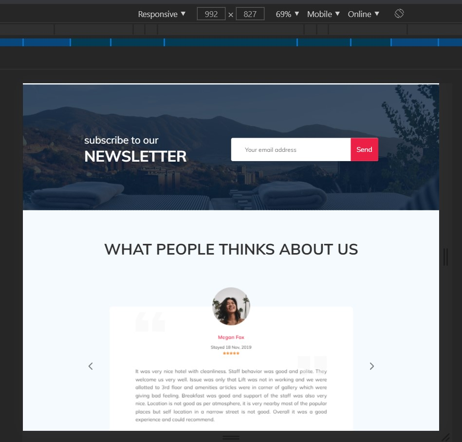
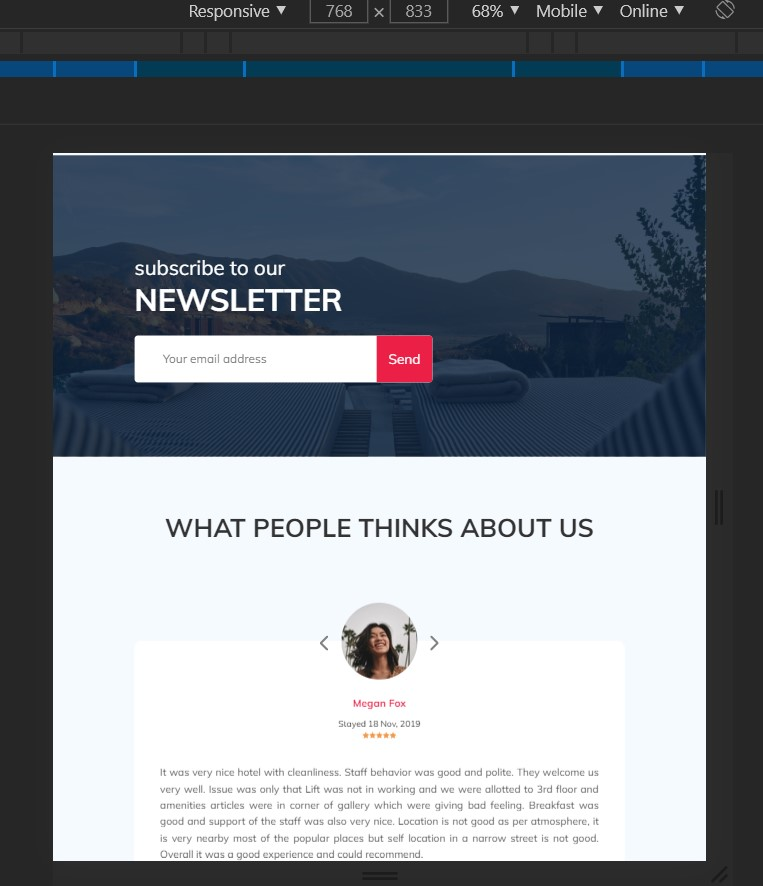
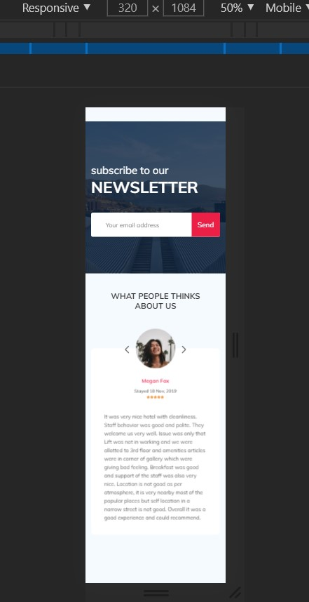

# Урок 22
## Практика: блок с подпиской и слайдер
## Результат
### width: 1200px

### width: 992px

### width: 768px

### width: 320px

### Усложненное. Параллакс-эффект
Подключить:
`
 `
Для секции "newsletter" добавить 2 атрибута <data-parallax="scroll" data-image-src="path/to/picture">
