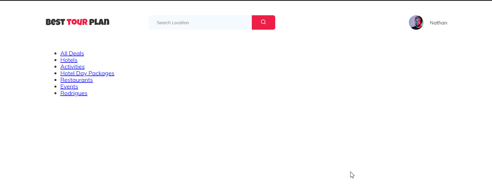
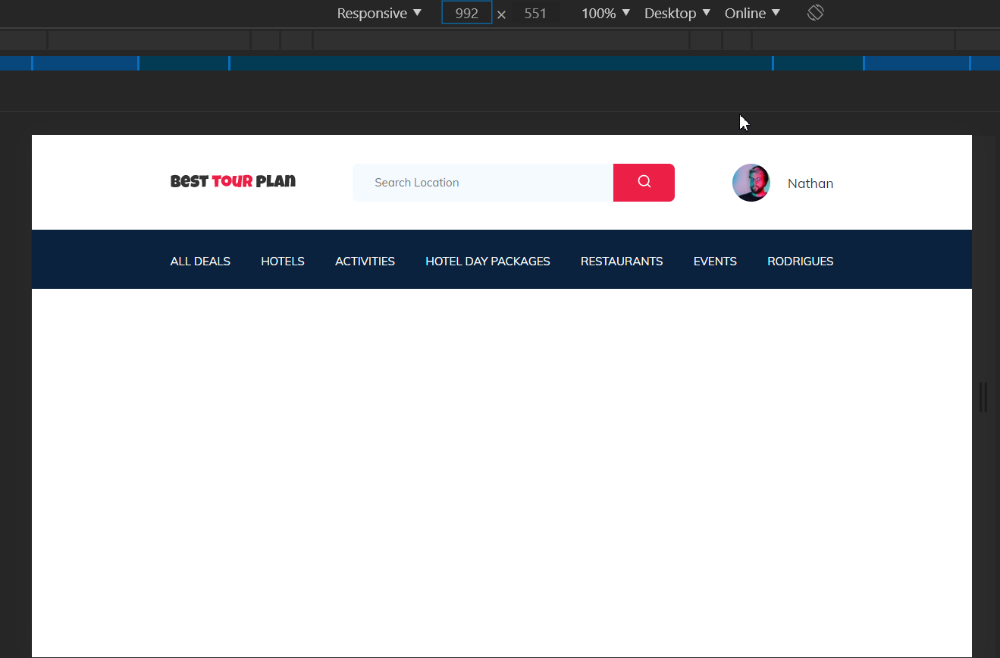
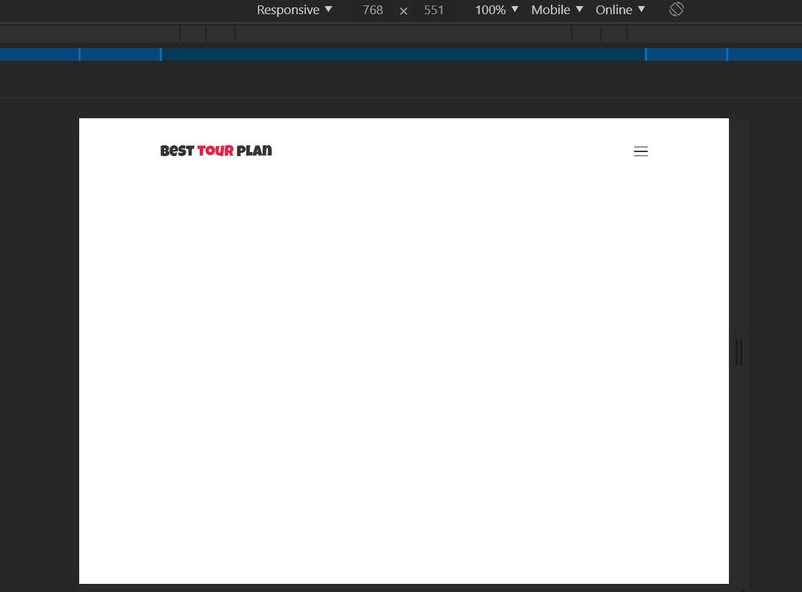
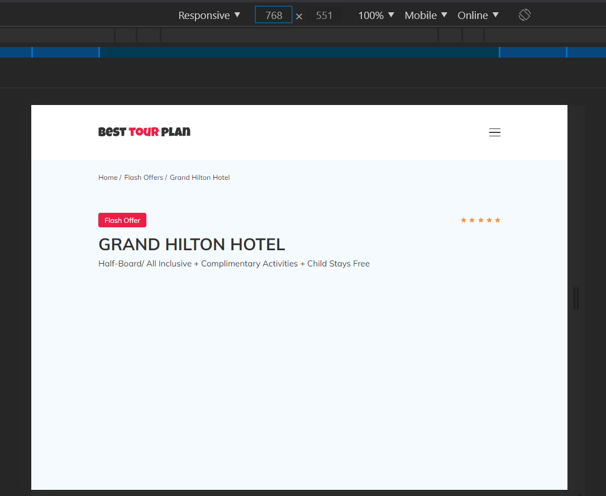

# Урок 16
## Результат

# Урок 17
## Результат

# Урок 18
## Адаптивная верстка на SASS
## Результат
### width: 1200px

### width: 992px

### width: 768px

# Урок 19
## Практика: псевдоэлементы
## Результат
### width: 1200px

### width: 992px

### width: 768px
